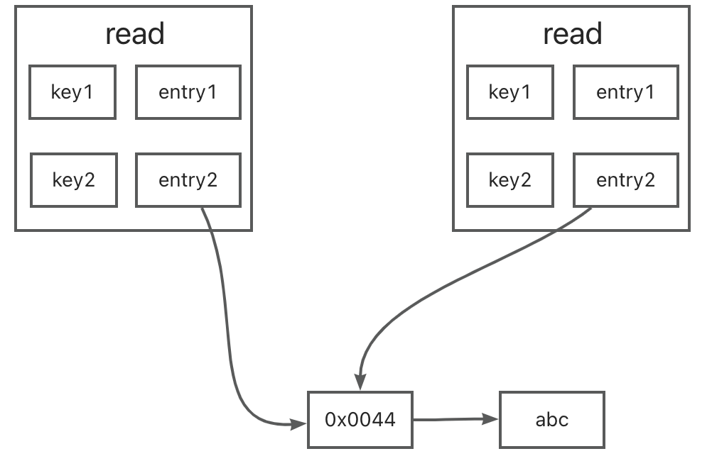

# sync.map的使用及原理

[toc]

## 一、介绍

Go的原生map是非线程安全的，如果想要并发读写map，需要加锁处理。但是加锁处理会影响到性能问题。于是，Go官方给出了一个并发安全的map: sync.map。

## 二、使用

先看看怎么使用再说

### 2.1 读

> func (m *Map) Load(key any) (value any, ok bool)

```
m:=sync.map{}
name, ok:=m.Store("name")   
if ok {
	fmt.Println(name)
}
```

### 2.2 写

> func (m *Map) Store(key, value any)

```ok
m:=sync.map{}
m.Store("go","ok")
```

### 2.3 删

> func (m *Map) Delete(key any)

```
m:=sync.map{}
m.Store("name")
```


### 2.4 其他

#### 2.4.1 LoadOrStore

```go
func (m *Map) LoadOrStore(key, value any) (actual any, loaded bool)
```

LoadOrStore逻辑如下：

- key存在：actual=key对应的值，loaded=true

- key不存在：actual=value，loaded=false

#### 2.4.2 LoadAndDelete

```go
func (m *Map) LoadAndDelete(key any) (value any, loaded bool)
```

LoadAndDelete的逻辑如下：

- key存在：value=key对应的值，loaded=true

- key不存在：value=nil，loaded=false

## 三、原理（1.19）

sync.Map中存在两个map，read map主要用于查询，类似查询缓存，dirty map中的都是新增的k-v。read map具有原子性，可以做到避免加锁就能查找数据，正是这一点，在读多写少的场景下，sync.Map比map+锁的形式 查询效率更高。

```
type Map struct {
   mu Mutex   			      // 锁，用于保护dirty的访问
	 read atomic.Value      // 只读的map，实际存储readOnly结构体 
   dirty map[any]*entry   // 可写的map
	 misses int    					// 从read中查询失败的次数
}

type readOnly struct {
   	m       map[any]*entry
   	amended bool 
}

type entry struct {
		p unsafe.Pointer 
}
```

- readOnly.amended：

  取值为true时，代表dirty中存在read中没有的键值对

- entry.p

  - 一般存储某个key对于的value值
  - 同时也有两个特殊的取值：nil，expunged，的Delete操作有关。

- read和dirty中，相同key底层引用了同一个entry，因此对read中的entry修改，也会影响到dirty




### 3.1 Store原理

源码注释：

```
func (m *Map) Store(key, value any) {
	read, _ := m.read.Load().(readOnly)
	// 如果read中存在该键值对，cas更新其value
	if e, ok := read.m[key]; ok && e.tryStore(&value) {
		return
	}
	// 接下来就是当前时刻read中没有该键值对的逻辑
	m.mu.Lock()
	read, _ = m.read.Load().(readOnly)
	// 如果加锁后发现read中有了
	if e, ok := read.m[key]; ok {
		// 如果该e是被删除状态，将其更新为nil
		if e.unexpungeLocked() {
			// 并且给dirty中增加该键值对，因为此时dirty中没有
			m.dirty[key] = e
		}
		// 更新value
		e.storeLocked(&value)
		// read没有，但dirty有，更新dirty中该entry的值
	} else if e, ok := m.dirty[key]; ok {
		e.storeLocked(&value)
		// dirty，read都没有
	} else {
		// 如果刚不存在read没有，dirty有的情况
		if !read.amended {
			// 将read浅拷贝到dirty中
			m.dirtyLocked()
			// 修改read.amended为true
			m.read.Store(readOnly{m: read.m, amended: true})
		}
		// 只将键值对加到dirty中
		m.dirty[key] = newEntry(value)
	}
	m.mu.Unlock()
}
```

流程：

1. 如果read中存在该值，直接更新dirty的值；如果read中不存在该值，加锁

2. 再次在read中读取Key：

   1. 如果存在，如果该e是被删除状态，
      1. 将其更新为nil，
      2. 并且给dirty中增加该键值对，因为此时dirty中没有
      3. 更新e的值，这样dirty有值了

   2. 如果不存在，那就去dirty中找：如果存在，更新值
   3. 如果read和dirty都不存在，
      1. 如果是刚提升dirty到read，此时dirty为空，需要将read浅复制到dirty中
      2. 如果不是，则只在dirty中增加键值对

### 3.2 Load原理

```
func (m *Map) Load(key any) (value any, ok bool) {
	read, _ := m.read.Load().(readOnly)
	e, ok := read.m[key]
	// 如果key在read中不存在，且dirty数据比read多，则去dirty中找
	if !ok && read.amended {
		m.mu.Lock()
		// 双重检查，再去read中找一次
		read, _ = m.read.Load().(readOnly)
		e, ok = read.m[key]
		// 如果read中还是没有，就去dirty中找
		if !ok && read.amended {
			e, ok = m.dirty[key]
			m.missLocked()
		}
		m.mu.Unlock()
	}
	if !ok {
		return nil, false
	}
	// 如果read中有该key，返回该value。从代码可读性角度来说，其实这一步可以在第4行直接返回
	return e.load()
}
```

流程：

1. 如果read中存在该值，直接返回；如果read中不存在该值，加锁
2. 如果key在read中不存在，且dirty数据比read多，则去dirty中找：
   1. 再次去read中找一次，如果read中还是没有，就去dirty中找

### 3.3 Delete原理

```
func (m *Map) Delete(key any) {
   m.LoadAndDelete(key)
}

func (m *Map) LoadAndDelete(key any) (value any, loaded bool) {
   read, _ := m.read.Load().(readOnly)
   e, ok := read.m[key]
   if !ok && read.amended {
      m.mu.Lock()
      read, _ = m.read.Load().(readOnly)
      e, ok = read.m[key]
      if !ok && read.amended {
         // 如果该key不在read中，在dirty中，调用map原生的删除方法删除
         e, ok = m.dirty[key]
         delete(m.dirty, key)
         // 更新misses值
m.missLocked()
      }
      m.mu.Unlock()
   }
   // 如果该key存在于read中，执行e.delete删除
   if ok {
      return e.delete()
   }
   return nil, false
}
```

流程：

1. 如果已经是被删除状态，直接返回
2. 否则将e.p更新为nil

### 3.4 Range原理

```
func (m *Map) Range(f func(key, value any) bool) {
read, _ := m.read.Load().(readOnly)
   if read.amended {
m.mu.Lock()
      read, _ = m.read.Load().(readOnly)
      if read.amended {
         read = readOnly{m: m.dirty}
         m.read.Store(read)
         m.dirty = nil
         m.misses = 0
      }
      m.mu.Unlock()
   }

   for k, e := range read.m {
      v, ok := e.load()
      if !ok {
         continue
}
      if !f(k, v) {
         break
}
   }
}
```

Range方法比较简单，如果dirty数据比read多，执行一次提升操作，然后遍历read

### 3.5 总结

#### 3.5.1 优点

1. 线程安全的
2. 多了一个专门读的缓存read， 减少了加锁的次数，提升了性能 
3. read和dirty使用同一个指针保存实际的值：
   1. 减少了内存开销
   2. 更新操作时候，实际内容更新了，read和dirty都更新了，减少了read和dirty的不同
   3. 删除操作能同步在查询的时候反馈出来
4. 主动释放内存，降低内存损耗

#### 3.5.2 缺点

1. 当修改操作增多的时候，加锁次数也会增多，降低了性能，适合读多写少的场景
2. 当missed次数达到阈值时，会触发操作，将dirty提升为read，这步骤相对比较的耗时

## 四、原理（1.22）

抄完发现源代码有更新了，再补充吧


## 参考

[Go学习-sync.Map](https://zhuanlan.zhihu.com/p/620632865)

[go语言 map底层实现原理 go sync.map底层实现](https://blog.51cto.com/u_16099271/6806907)

[Golang sync.Map 原理（两个map实现 读写分离、适用读多写少场景）](https://blog.csdn.net/qq_37102984/article/details/128154924)